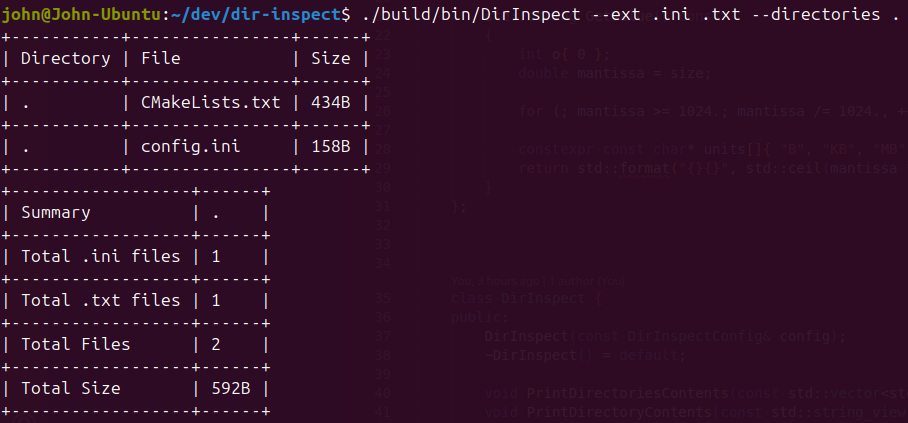

# Dir Inspect
**A C++ tool for scanning target directories and summarize their content.**



# Build

**Prerequisites**

- CMake version 3.21 or higher
- Ninja build system
- A C++ compiler with C++23 support (GCC 13+, Clang 16+, or MSVC 2022)


**Release Build**

```bash
cmake --preset=default
cmake --build build
```

Binary file should be located at:
```bash
build/bin/DirInspect
```


# Usage

## Run with Command-Line Arguments
```bash
./DirInspect --recursive --summary-only --directories . /foo/ --ext .txt .md .ini
```

**Available Options**

| Option                 | Description                                     |
| ---------------------- | ----------------------------------------------- |
| `-D`, `--directories`  | One or more target directories (required)       |
| `--ext`                | File extensions to include (e.g. `.txt .png`)   |
| `-R`, `--recursive`    | Recursively scan directories                    |
| `-S`, `--summary-only` | Print only summary info, no file table output   |
| `-C`, `--config`       | Path to INI config file (default: `config.ini`) |


## Example Using Config File

**config.ini**
```ini
; Configuration for dir-inspect

recursive=true
summaryOnly=false
directories=".", "/foo/"
ext=".png", ".bmp", ".dds", ".tga", ".mp4", ".avi", ".mov", ".mkv", ".ini", ".md", ".txt"
```

**Run**
```bash
./DirInspect --config config.ini
```


# Dependencies

- [CLI11](https://github.com/CLIUtils/CLI11)
- [tabulate](https://github.com/p-ranav/tabulate)
